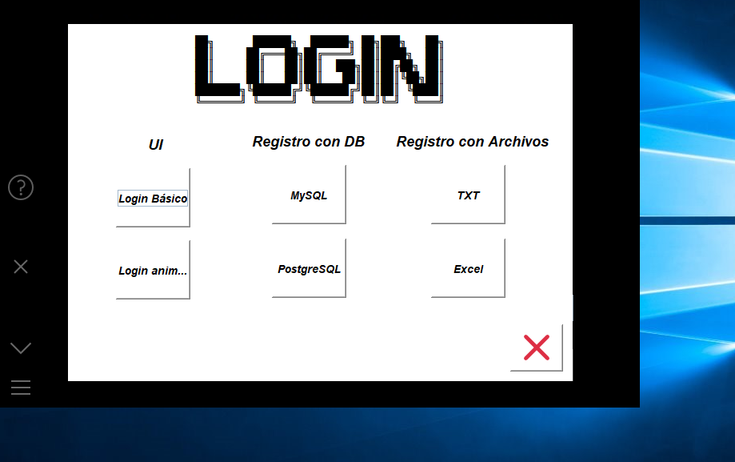

# From: Team Wasp
# Aplicación de tareas y proyectos comunes de la universidad

> Versión 1.0.1

> SO: Windows

# Programas Consola

> Número de Champernowne Go

> Space Shooter C++

> Tres en raya C++

> Fibonacci Go

> Figuras Go

# Programas gráfico

> Logins Java