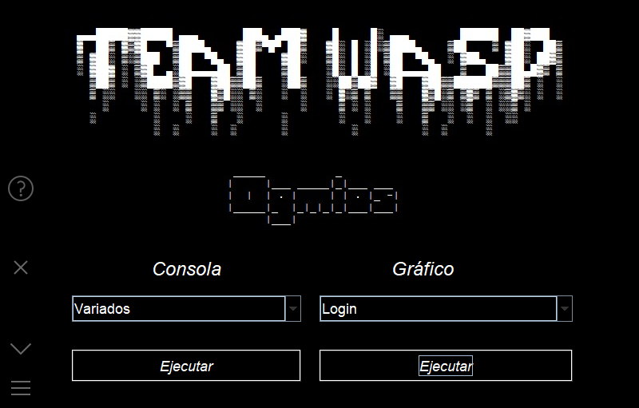
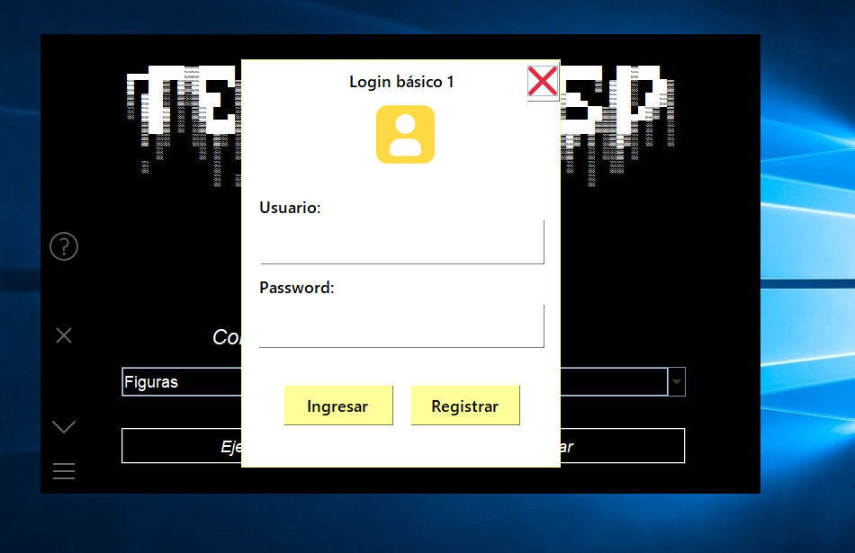

# From: Team Wasp
# Aplicación de tareas y proyectos comunes de la universidad

> Versión 1.1.3

> SO: Windows

# Programas Consola

> Número de Champernowne Go

> Space Shooter C++

> Tres en raya C++

> Fibonacci Go

> Figuras Go

> Variados Go

> Media Mediana Moda c++

> Varianza y Des

# Programas gráfico

> Logins Java

> Games with Unity